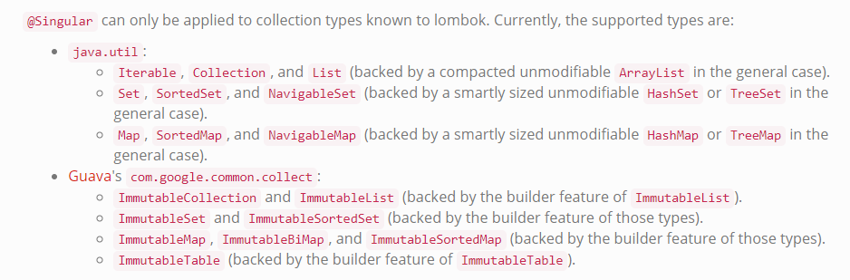

## @Builder

@Builder使用构建者模式，允许您使用以下代码自动生成使您的类可实例化所需的代码 
Person.builder().name("Adam Savage").city("San Francisco").job("Mythbusters").job("Unchained Reaction").build(); 
它把我们的Bean类包装为一个构建者模式，编译时增加了一个Builder内部类和全字段的构造器。 

- @Builder可以放在类，构造函数或方法上。  
1.@Builder放在构造函数/方法，会对方法参数生成字段。 
2.@Builder放在类上，类似您将@AllArgsConstructor（access = AccessLevel.PACKAGE）添加到类中并将@Builder注释应用于此all-args构造函数。 

- @Builder可配置@singular参数，可对集合进行赋值。
private String [] jobs; 
Person.builder().job("Mythbusters").job("Unchained Reaction").build(); 可以使用这种方式对集合进行赋值

- @Builder(builderClassName = "HelloWorldBuilder", buildMethodName = "execute", builderMethodName = "helloWorld", toBuilder = true)
1.构建器的类名（默认值：返回类型+'Builder'）
2.build（）方法的名称（默认值：“build”）
3.builder（）方法的名称（默认值：“builder”）
4.如果你想要toBuilder（）（默认值：no）

注意：如果在字段上进行初始化赋值，则需要添加@Builder.Default:

@Builder应用于名为com.yoyodyne.FancyList <T>的类，则构建器名称将为FancyListBuilder <T>
如果@Builder应用于返回void的方法，则构建器将命名为VoidBuilder。
 
这仅适用于您自己没有编写任何显式构造函数的情况。如果你有一个显式的构造函数，请将@Builder注释放在构造函数而不是类上，不然会报错。

如果一个参数没有在初始化时进行赋值，则为 it always gets 0 / null / false.

@Singular只能应用于lombok已知的集合类型。目前，支持的类型是：

 
 
lombok.singular.useGuava = [true | false]  
如果为true，lombok将使用guava的ImmutableXxx构建器和类型来实现java.util集合接口，而不是基于Collections.unmodifiableXxx创建实现。 如果使用此设置，则必须确保guava实际上在类路径和构建路径上可用。
 
如果您的字段/参数具有guava的 ImmutableXxx类型之一，则会自动使用Guava。
 
@Singular对java.util.NavigableMap / Set的支持仅在使用JDK1.8或更高版本进行编译时才有效。
 
已排序的集合（java.util：SortedSet，NavigableSet，SortedMap，NavigableMap和guava：ImmutableSortedSet，ImmutableSortedMap）要求集合的type参数具有自然顺序（实现java.util.Comparable）。无法传递显式比较器以在构建器中使用。

~~~java
@Builder
public class BuilderExample {
  private String name;
  private int age;
  @Singular private Set<String> occupations;
}
~~~
翻译后：

~~~java
public class BuilderExample {
  private String name;
  private int age;
  private Set<String> occupations;
  
  BuilderExample(String name, int age, Set<String> occupations) {
    this.name = name;
    this.age = age;
    this.occupations = occupations;
  }
  
  public static BuilderExampleBuilder builder() {
    return new BuilderExampleBuilder();
  }
  
  public static class BuilderExampleBuilder {
    private String name;
    private int age;
    private java.util.ArrayList<String> occupations;
    
    BuilderExampleBuilder() {
    }
    
    public BuilderExampleBuilder name(String name) {
      this.name = name;
      return this;
    }
    
    public BuilderExampleBuilder age(int age) {
      this.age = age;
      return this;
    }
    
    public BuilderExampleBuilder occupation(String occupation) {
      if (this.occupations == null) {
        this.occupations = new java.util.ArrayList<String>();
      }
      
      this.occupations.add(occupation);
      return this;
    }
    
    public BuilderExampleBuilder occupations(Collection<? extends String> occupations) {
      if (this.occupations == null) {
        this.occupations = new java.util.ArrayList<String>();
      }

      this.occupations.addAll(occupations);
      return this;
    }
    
    public BuilderExampleBuilder clearOccupations() {
      if (this.occupations != null) {
        this.occupations.clear();
      }
      
      return this;
    }

    public BuilderExample build() {
      // complicated switch statement to produce a compact properly sized immutable set omitted.
      // go to https://projectlombok.org/features/Singular-snippet.html to see it.
      Set<String> occupations = ...;
      return new BuilderExample(name, age, occupations);
    }
    
    @java.lang.Override
    public String toString() {
      return "BuilderExample.BuilderExampleBuilder(name = " + this.name + ", age = " + this.age + ", occupations = " + this.occupations + ")";
    }
  }
}
~~~
