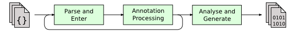
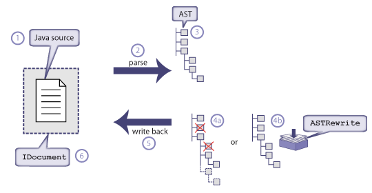
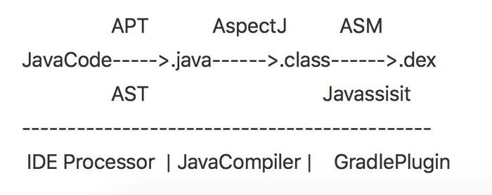
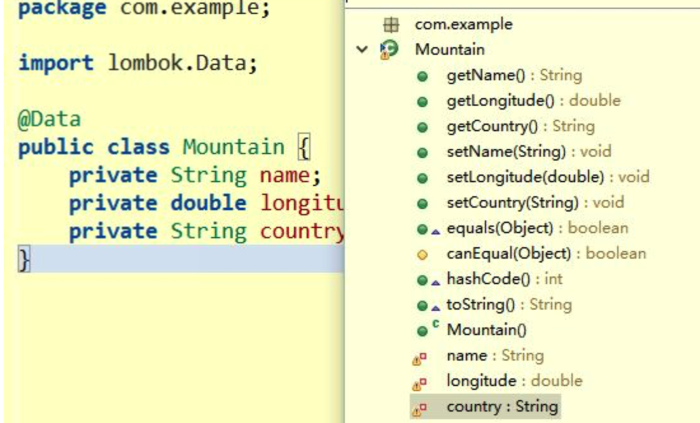

## 1. 什么是JSR 269

Annotation（标记）是java 5里面引进来的，用于在源代码里面附加元信息（meta-information）.
Java 6则进一步加强了标记的处理功能，即JSR269. JSR269，即插入式标记处理API，
为java编译器添加了一个插件机制。有了JSR269，就有能力为java编译器写一个特定的标记处理器了。

JSR269有两组基本API，一组用于对java语言的建模，一组用于编写标记处理器。
这两组API分别存在于javax.lang.model.* 和 javax.annotation.processing里面。
JSR269的功能是通过以下的java编译选项来调用的。

-proc:{none,only} 是否执行Annotation处理或者编译

-processor <classes> 指定标记处理器的名字。
这个选项将绕过默认的标记处理器查找过程

-processorpath <path> 指定标记处理器的位置

标记处理在javac中时默认开启的。如果要是只想处理标记，
而不想编译生成类文件的话，用 –proc:only 选项既即可。

## 2.AST简介


AST（Abstract syntax tree）即为“抽象语法树”，是编辑器对代码的第一步加工之后的结果，是一个树形式表示的源代码。源代码的每个元素映射到一个节点或子树。
Java的编译过程可以分成三个阶段：



解析与填充符号表的过程：指词法、语法分析、填充符号表。

插入式注解处理器的注解处理过程，调用注解处理器。如果注解处理器产生了新的源文件，新文件也要进行编译。

最后，语法树会被分析并转化成类文件。 （语义分析与字节码生成）


---
编辑器对代码处理的流程大概是：

```
JavaTXT->词语法分析-> 生成AST ->语义分析 -> 编译字节码
```


通过操作AST，可以达到修改源代码的功能,他的时机更为提前：


### 什么是 AST 转换？

AST 转换 是在编译过程中用来修改抽象语法树结构的代码的名称。
修改 AST，通过在将其转换为字节码之前增加附加节点，是更好的生成代码的方法。

### 如何操作AST？

直接使用Javac语法生成AST:

```java
if (!fields.isEmpty() || callSuper) {
   statements.append(maker.VarDef(maker.Modifiers(Flags.FINAL),
       primeName, maker.TypeIdent(Javac.getCTCint(TypeTags.class, "INT")), 
       maker.Literal(31)));
 }
```

在javac.tree的JCTree里面，几乎可以看到所有常用语法的关键字：<br>
比如JCImport，JCClassDecl、JCIf、JCBreak、JCReturn、JCThrow
、JCDoWhileLoop、JCTry、JCCatch、JCAnnotation等，你可以直接用这些对象的操作组合成你想要的源码。

### 扩展AST：

#### 样板代码less：著名的Lombok，注解@Data，自动生成setter、getter，toString、equals、hashCode等模版方法

Lombok除了可以修改AST，还可以联合编辑器做消除警告和代码提示。
在保存代码的时候，悄无声息的生成了新的AST，并且在编辑器上给予你代码
提示的功能。然而你看到的，仍然是最初的简洁的代码。




